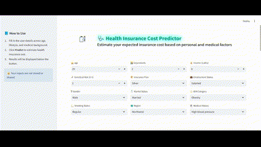
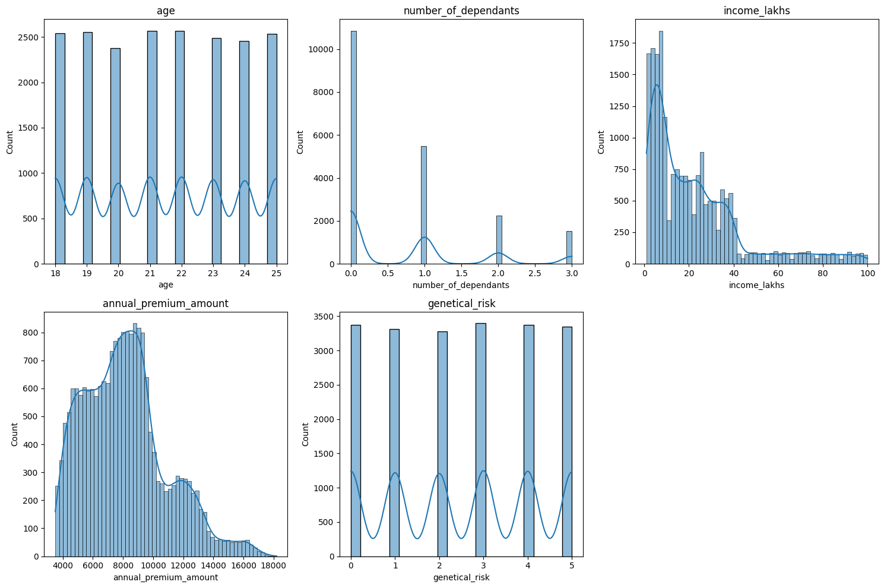
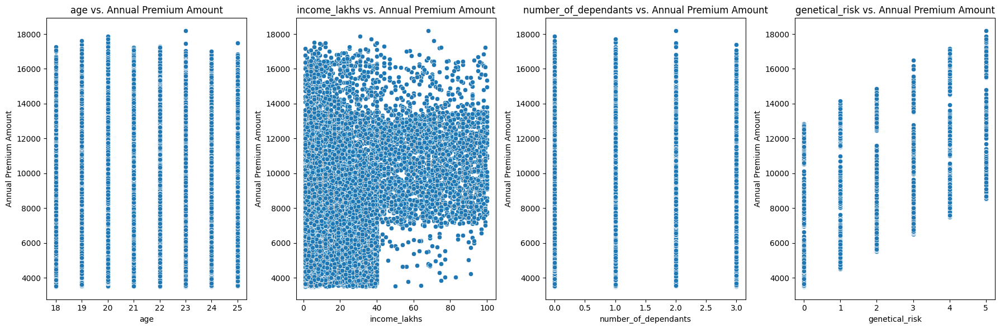
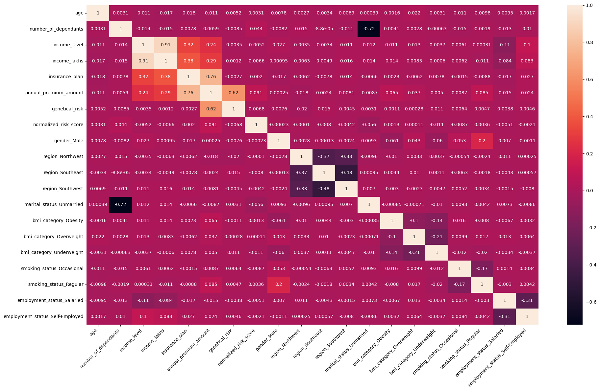
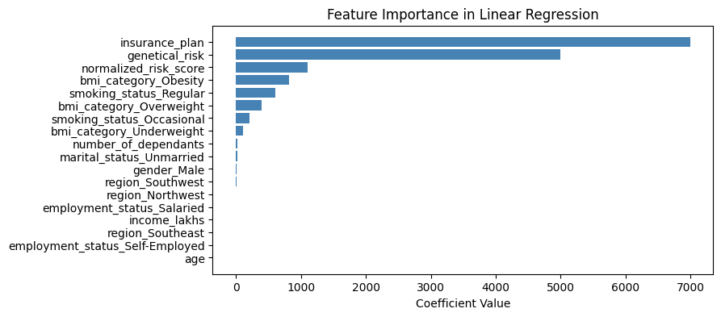
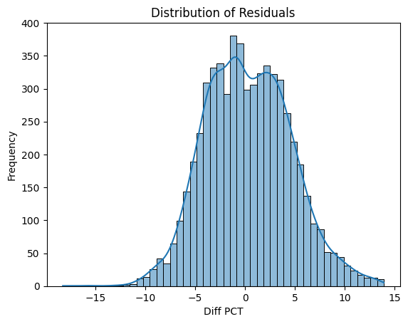
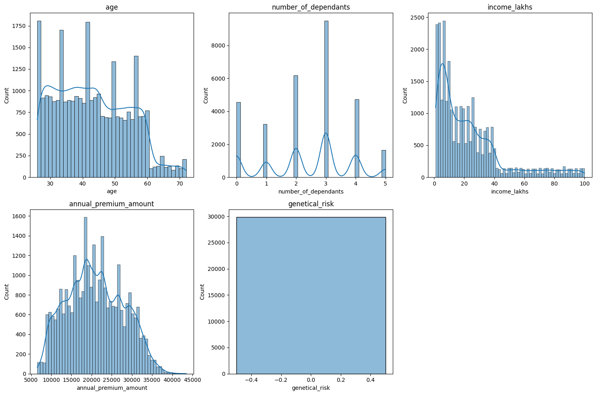
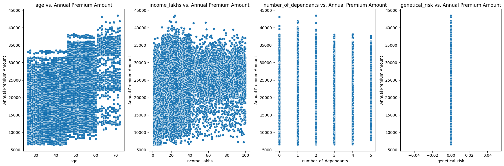
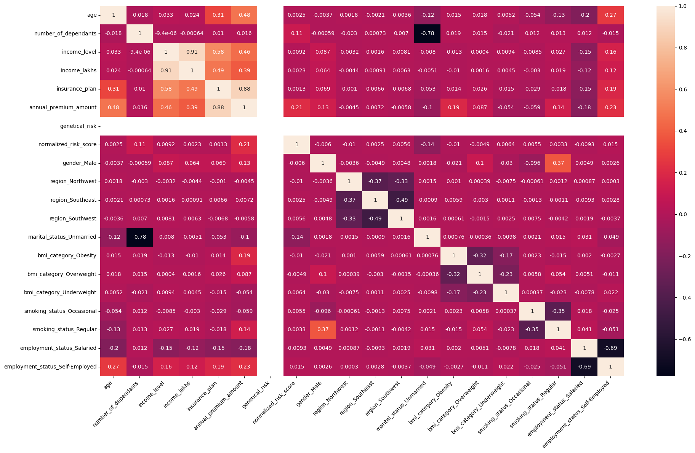
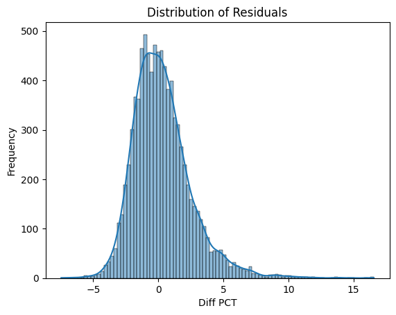

# Healthcare Premium Prediction

An interactive web app that predicts personalized **health insurance premiums** based on user inputs such as age, BMI, smoking status, and medical history. Built using **XGBoost** and deployed via **Streamlit**, it enables real-time, explainable premium predictions with model segmentation by age group.

---

## Live App
You can access the deployed app here:
[Healthcare Premium Prediction - Streamlit](https://mlhealthcare-premium-prediction.streamlit.app/)

---

## 🎥 App Demo




---


## Features
This project demonstrates the power of **machine learning for personalized pricing** in the health insurance domain. It includes:

- Interactive **Streamlit** web application.
- Predicts health insurance premium based on user inputs.
- Uses **XGBoost** models trained for different age groups.
- **Scikit-learn** for preprocessing and scaling data.
- Models and scalers are preloaded using **joblib**.

---


## How it Works
1. Users provide input values such as age, medical history, BMI, smoking status, etc.
2. The **Streamlit UI** captures the inputs and passes them to `prediction_helper.py`.
3. Data is **preprocessed and scaled** using appropriate models.
4. The prediction model is selected based on the user's age:
   - If **Age ≤ 25** → Uses `model_young.joblib`
   - If **Age > 25** → Uses `model_rest.joblib`
5. The predicted insurance premium is displayed.

---


## ❓ Why It Matters

Insurers are increasingly shifting toward personalized, data-driven pricing. This app:
- Demonstrates **model segmentation** for different risk populations
- Encourages **explainability and user interaction**
- Serves as a portfolio-ready ML pipeline from notebook to production

---

## 📊 Visual Insights

Below are key insights and visualizations derived during model development. These plots support feature selection, model explainability, and validation across age segments.

| 📸 Screenshot | 🔍 Description |
|--------------|----------------|
|  | Feature distributions for numeric fields (e.g., age, income, premium) show skew, concentration and transformation needs. |
|  | Scatter plots relate inputs (age, income, dependents, risk) with premium — key to understanding nonlinear dependencies. |
|  | Heatmap showing correlations between all encoded features, including demographics, habits and premium levels. |
|  | Linear regression feature importance — shows insurance plan, risk, and obesity as strongest premium drivers. |
|  | Residual distribution plot visualizes how close predictions are to actual premium values — model is well calibrated. |
|  | Histogram + KDE plots of top features (BMI, age, premium) confirm expected distributions and model readiness. |
|  | Scatter plots for young age group show strong premium ties to age, risk and income even in early adulthood. |
|  | Correlation matrix for young segment validates distinct patterns compared to older group (e.g., income vs. premium). |
|  | Feature coefficients in linear regression model (for young segment) reveal age and risk as dominant cost factors. |
|  | Residual plot (young group) shows mild underprediction for mid-risk clients — supports model refinement. |

---


## File Structure
```
├── main.py                         # Streamlit web app for user input and prediction
├── prediction_helper.py             # Helper functions for preprocessing and prediction
├── requirements.txt                 # Dependencies required to run the project
├── artifacts/                       # Folder containing trained models and scalers
│   ├── model_young.joblib
│   ├── model_rest.joblib
│   ├── scaler_young.joblib
│   ├── scaler_rest.joblib
├── Notebooks/                       # Jupyter Notebooks for model training and analysis
│   ├── data_segmentation.ipynb
│   ├── ml_premium_prediction.ipynb
│   ├── ml_premium_prediction_rest.ipynb
│   ├── ml_premium_prediction_rest_with_gr.ipynb
│   ├── ml_premium_prediction_young.ipynb
│   ├── ml_premium_prediction_young_with_gr.ipynb
```

---
 
## Installation
1. Clone the repository:
    ```bash
    git clone https://github.com/your-username/healthcare-premium-prediction.git
    cd healthcare-premium-prediction
    ```
2. Create a virtual environment (optional but recommended):
    ```bash
    python -m venv venv
    source venv/bin/activate  # For macOS/Linux
    venv\Scripts\activate  # For Windows
    ```
3. Install dependencies:
    ```bash
    pip install -r requirements.txt
    ```

---

## Running the Application Locally
To start the **Streamlit** web application locally, run:
```bash
streamlit run main.py
```
---

## Technologies Used
- **Python** (3.9+ recommended)
- **Streamlit** (Web interface)
- **Scikit-learn** (Preprocessing)
- **XGBoost** (Model Training)
- **Pandas** & **NumPy** (Data Handling)
- **Joblib** (Model Persistence)

---

## Contributing
Feel free to fork this repository and submit pull requests.

Credits: Codebasics

---


