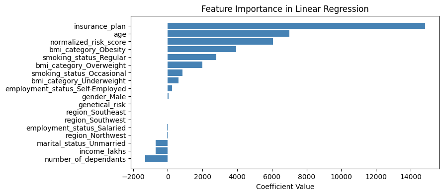

# Healthcare Premium Prediction

An interactive web app that predicts personalized **health insurance premiums** based on user inputs such as age, BMI, smoking status, and medical history. Built using **XGBoost** and deployed via **Streamlit**, it enables real-time, explainable premium predictions with model segmentation by age group.

---

## Live App
You can access the deployed app here:
[Healthcare Premium Prediction - Streamlit](https://mlhealthcare-premium-prediction.streamlit.app/)

---

## 🎥 App Demo

<p align="center">
  
</p>

<p align="center">
  <a href="https://mlhealthcare-premium-prediction.streamlit.app" target="_blank">
    
  </a>
  <br/>
  <em>▶ Click above to explore the full interactive app</em>
</p>

---


## Features
This project demonstrates the power of **machine learning for personalized pricing** in the health insurance domain. It includes:

- Interactive **Streamlit** web application.
- Predicts health insurance premium based on user inputs.
- Uses **XGBoost** models trained for different age groups.
- **Scikit-learn** for preprocessing and scaling data.
- Models and scalers are preloaded using **joblib**.

---


## How it Works
1. Users provide input values such as age, medical history, BMI, smoking status, etc.
2. The **Streamlit UI** captures the inputs and passes them to `prediction_helper.py`.
3. Data is **preprocessed and scaled** using appropriate models.
4. The prediction model is selected based on the user's age:
   - If **Age ≤ 25** → Uses `model_young.joblib`
   - If **Age > 25** → Uses `model_rest.joblib`
5. The predicted insurance premium is displayed.

---


## ❓ Why It Matters

Insurers are increasingly shifting toward personalized, data-driven pricing. This app:
- Demonstrates **model segmentation** for different risk populations
- Encourages **explainability and user interaction**
- Serves as a portfolio-ready ML pipeline from notebook to production

---

## 📊 Visual Insights

| Screenshot | Description |
|-----------|-------------|
|  | Medical history vs. premium — shows the cost impact of chronic conditions |
|  | XGBoost feature importance plot highlighting key predictors |
|  | BMI category vs. cost — highlights obesity-linked premium hikes |
|  | Age and premium distribution across both age segments |
|  | Correlation matrix of encoded input features |
|  | Histogram of predicted premium clusters |
|  | Risk profile by smoking and alcohol use |
|  | Model performance metrics for both age-based models |

---


## File Structure
```
├── main.py                         # Streamlit web app for user input and prediction
├── prediction_helper.py             # Helper functions for preprocessing and prediction
├── requirements.txt                 # Dependencies required to run the project
├── artifacts/                       # Folder containing trained models and scalers
│   ├── model_young.joblib
│   ├── model_rest.joblib
│   ├── scaler_young.joblib
│   ├── scaler_rest.joblib
├── Notebooks/                       # Jupyter Notebooks for model training and analysis
│   ├── data_segmentation.ipynb
│   ├── ml_premium_prediction.ipynb
│   ├── ml_premium_prediction_rest.ipynb
│   ├── ml_premium_prediction_rest_with_gr.ipynb
│   ├── ml_premium_prediction_young.ipynb
│   ├── ml_premium_prediction_young_with_gr.ipynb
```

---
 
## Installation
1. Clone the repository:
    ```bash
    git clone https://github.com/your-username/healthcare-premium-prediction.git
    cd healthcare-premium-prediction
    ```
2. Create a virtual environment (optional but recommended):
    ```bash
    python -m venv venv
    source venv/bin/activate  # For macOS/Linux
    venv\Scripts\activate  # For Windows
    ```
3. Install dependencies:
    ```bash
    pip install -r requirements.txt
    ```

---

## Running the Application Locally
To start the **Streamlit** web application locally, run:
```bash
streamlit run main.py
```
---

## Technologies Used
- **Python** (3.9+ recommended)
- **Streamlit** (Web interface)
- **Scikit-learn** (Preprocessing)
- **XGBoost** (Model Training)
- **Pandas** & **NumPy** (Data Handling)
- **Joblib** (Model Persistence)

---

## Contributing
Feel free to fork this repository and submit pull requests.

Credits: Codebasics

---


